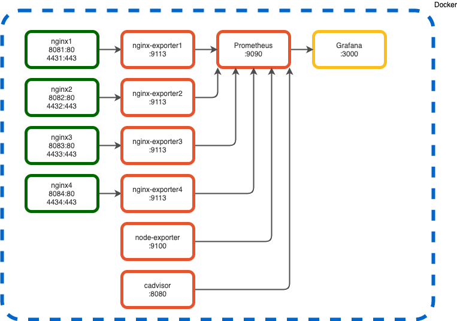

# LAB prostředí - Docker

## Komponenty
  * [Docker](https://www.docker.com/)
  * [NGINX](https://www.nginx.com/)
  * [Prometheus](https://prometheus.io/)
  * [Grafana](https://grafana.com/)
<br>



## Funkce

Na NGINX OSS web serverech je publikována jednoduchá aplikace, která má na všech WS stejný index.html, ale rozdílné obrázky. Každý NGINX OSS publikuje statistiky, které jsou vyčítány nginx-exporter kontejnerem a předávány do Prometheusu. Dále node-exporter vyčítá data o stroji, kde běží a cadvisor detailní informace o kontejnerech. Veškerá data se shromažďují v Prometheusu, odkud je vyčítá a zobrazuje Grafana.

## Prerekvizity
  * Docker
  * Docker-compose

## Použití

Klon repozitáře:
```
git clone https://github.com/jiridoubek/lab-env
```

Nebo stažení a rozbalení:
```
curl https://github.com/jiridoubek/lab-env/archive/master.zip
uzip master.zip
```

Start projektu:
```
docker-compose up
```

## ARM

202008 - nginx prometheus exporter je v docker hubu zkompilovaný jen pro amd64. Pokud je potřeba spustit na jiné architektuře:
```
git clone https://github.com/nginxinc/nginx-prometheus-exporter.git
cd nginx-prometheus-exporter/
make container
```

---

## TODO
  * grafana dashboards
  * github
  * jenkins
  * nginx https

